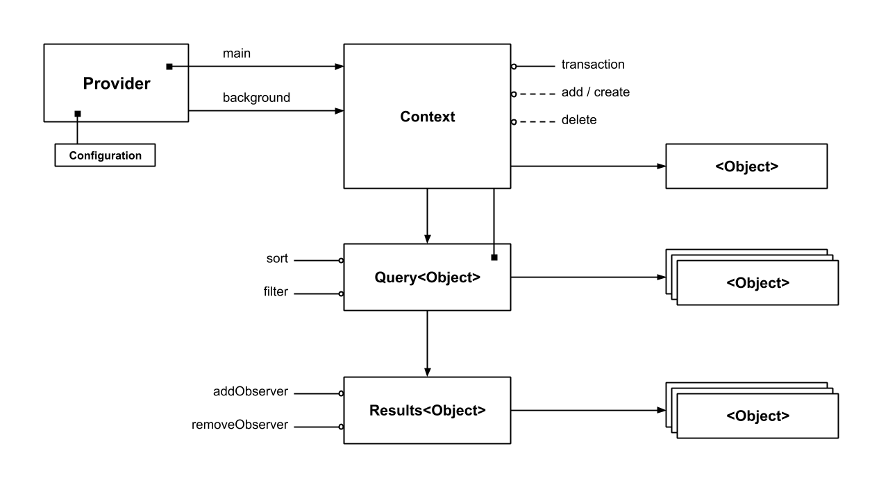

# FlooidCoreData
A simple CoreData wrapper


## Setup

1. Create a `CoreDataConfiguration`
```swift
let configuration = CoreDataConfiguration(modelName: "MyAppDataModel", inMemory: false)
```
> This object includes the `NSManagedObjectModel` and `NSPersistentStoreCoordinator` as well as a _privateQueue_ `NSManagedObjectContext`. The private context is then used as a parent to the _mainQueue_ context. At the moment you cannot change this configuration, but in future updates you will be allowed to provide your own configuration.

2. Create a `CoreDataProvider`: this object stores a main context and, via closure, can provide you with a background context
```swift
let coreDataProvider = CoreDataProvider(configuration: configuration)
...

let mainContext = coreDataProvider.mainContext
// do stuff on the main thread via mainContext
...

coreDataProvider.performInBackground(action: { backgroundContext, done in
  // do stuff in background via backgroundContext and once ready call done()
  done()
}, then: {
  // do stuff back on the main thread
})
```

3. Conform your CoreData entity classes to `DataObjectProtocol`
```swift
extension UserCoreDataObject: DataObjectProtocol {
    public static func idKey() -> String { return "id" }
    public static func entityName() -> String { return "User" }
    ...
}
```

## Usage
When you use `CoreDataProvider`'s `mainContext` (or the background one via `performInBackground`) what you actually get is an object of type `CoreDataContext`, which wraps a `NSManagedObjectContext`.
Using this object you can perform transactions, execute queries, get live results, or find or create entities.

```swift
let context: CoreDataContext
...

// Transactions
context.transaction { transactionContext

  // Find or create
  let user = UserCoreDataObject.findOrCreate(forID: "123", in: transactionContext)
  
  // Delete
  transactionContext.delete(user)
  
  // Find One (and update)
  let user2 = UserCoreDataObject.object(forID: "111", in: transactionContext)
  user2?.name = "Jon Anec"
}
// After the block is completed, the `context` object takes care of merging the changes you've made.
...

// Querying
let adminUsersQuery = UserCoreDataObject.query(in: context)
    .filter(NSPredicate("role = %@", "admin"))
    .filter(NSPredicate("deleted = %d", false)) // Chaining filters will result in "NSCompoundPredicate(andPredicateWithSubpredicates:)" on them
    .sort(NSSortDescriptor(key: "name", ascending: true))

let adminUsers = adminUsersQuery.execute()

// Get an automatically updatable (and observable) results object
let adminUsersResults = adminUsersQuery.results()
let usersFromResult = adminUsersResults.objects
...

adminUsersResults.addObserver(self, #selector(usersChanged), .updated)

```
